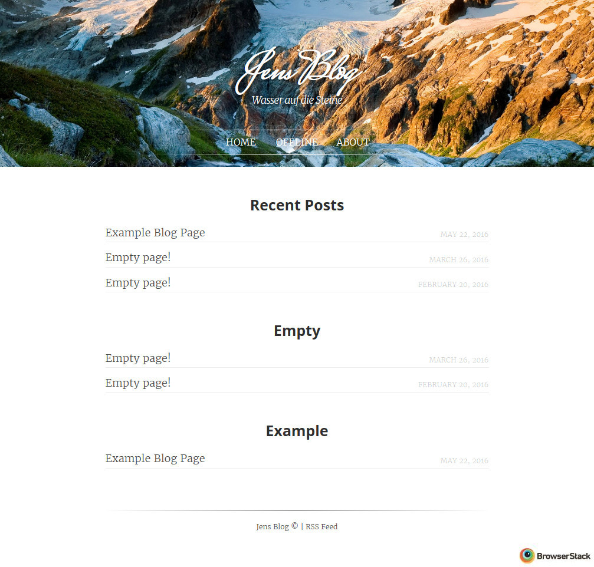

# jekyllDecent
 

This is a blog template for a static site generator named [Jekyll](https://jekyllrb.com/docs/home/) based on a [Ghost](https://ghost.org) template named [Decent](https://github.com/serenader2014/decent). 

Installation instructions, features, previews and more can be found in the **[GitHub generated blog](http://jwillmer.github.io/jekyllDecent)**. This blog is automatically generated out of the source code in the `gh-pages` branch. If you like to see the theme in production have a look at [jwillmer.de](http://jwillmer.de).

