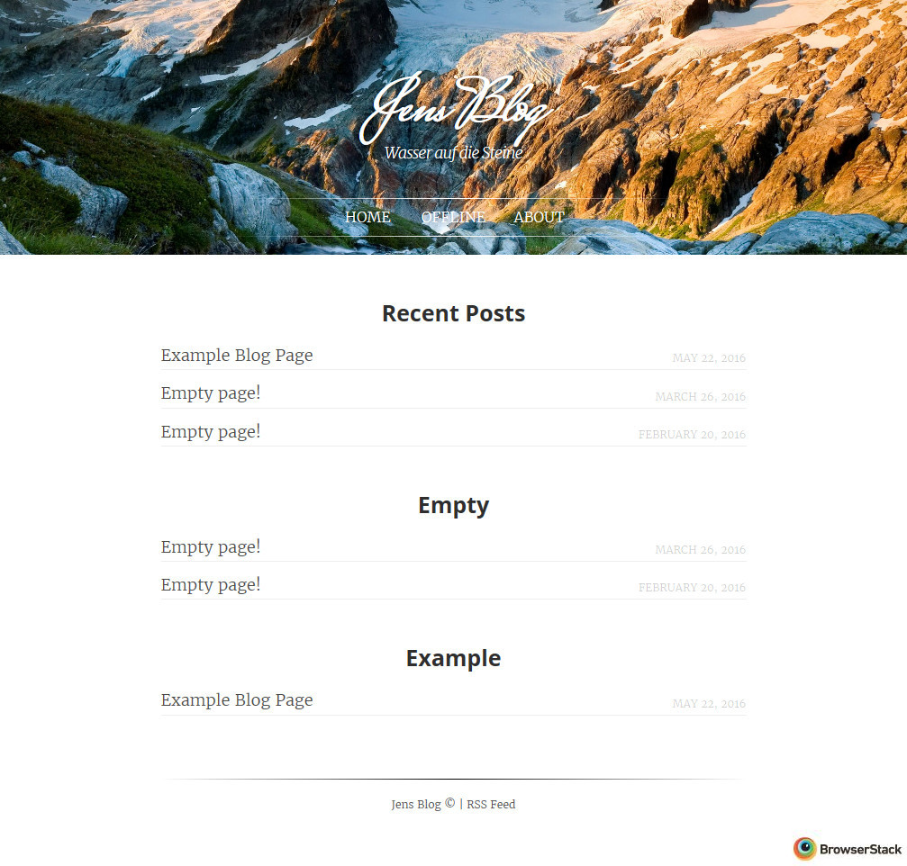
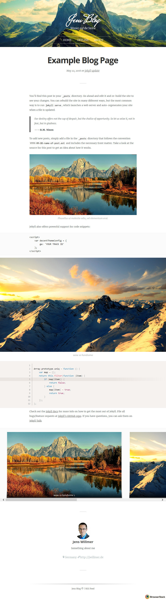

# jekyllDecent
Blog template for a static site generator named[Jekyll](https://jekyllrb.com/docs/home/) based on a [Ghost](https://ghost.org) template named [Decent](https://github.com/serenader2014/decent).

**Live demo** can be visit at [gh-pages](http://jwillmer.github.io/jekyllDecent).

Installation instructions and feature description can be found in the [wiki](https://github.com/jwillmer/jekyllDecent/wiki/Tutorial) or at the end of this page.

## Example Previews

### Home


### Post


## Installation

- To generate the blog you need to [install Jekyll](https://jekyllrb.com/docs/installation/)
- For Windows installation:
  - install [chocolatey](https://chocolatey.org/) a package manager 
  - use the command promt to install ruby: `choco install ruby -y` 
  - use the command prompt to install jekyll: `gem install jekyll`
  - [Detailed tutorial by Burela](https://davidburela.wordpress.com/2015/11/28/easily-install-jekyll-on-windows-with-3-command-prompt-entries-and-chocolatey/) 
- To locally display the blog and auto update on file changes open a command prompt and type `jekyll serve`
- To build the static site you can use the generated site folder that Jekyll creates when you use `jekyll serve` or you can build it explicitly with `jekyll build`.
- If you like to use GitHub to host your blog you can fork this project and publish the code to `gh-pages`. GitHub has jekyll included and will generate the site for you.
- If you have exceptions while starting the blog with `jekyll serve` try to remove `Gemfile` and remove all `gems:` from the `_config.yml`  

## Content

Blogposts can be written in [Markdown](https://de.wikipedia.org/wiki/Markdown). 

- The folder for blog content is `_posts`
- For author details you need to modify ´_data/authors.yml`
- For site properties (like the name) you need to modify `_config.yml`
- For the about page you need to modify the `about.md` in `_pages`

After modifying `*.yml` files you need to restart jekyll to take effect.


## Features

The `{{ site.github.url }}` is only needed if you like to host the blog on GitHub. 

### Images Features


#### Parallax Effect

Keep in mind that paralax effect will not be captured if you like to print the page.

```
<div class="bg-scroll" style="background-image: url('{{ site.github.url }}/media/img/mountain1.jpg')"></div>
```

#### Caption for Image

```
<figure>

<figcaption>This is figcaption. A beautiful picture.</figcaption>
</figure>
```

#### Image Allignment

```


```

Allignment with caption

```
<figure class="left">

<figcaption>hello world!</figcaption>
</figure>
```

#### Fullscreen image

```
<div class="large">

</div>
```

With caption

```
<figure class="large">

<figcaption>wow so handsome</figcaption>
</figure>
```

#### Image Gallery

```
<div class="album">


</div>
```

With caption

```
<div class="album">
<figure>

<figcaption>wow so handsome</figcaption>
</figure>

<figure>

<figcaption>wow so handsome</figcaption>
</figure>

</div>
```

### Sourcecode Features

With language highlighting

```
    ```html
    <script>
        var decentThemeConfig = {
            ga: 'YOUR TRACK ID'
        };
    </script>
    ```
```

With language highlighting, line numbers and line highlighting

```
<pre data-line="5" class="line-numbers language-javascript"><code>
Array.prototype.uniq = function () {
    var map = {};
    return this.filter(function (item) {
        if (map[item]) {
            return false;
        } else {
            map[item] = true;
            return true;
        }
    });
};
</code></pre>
```

### Author in quote

```
> Our destiny offers not the cup of despair, but the chalice of opportunity. So let us seize it, not in fear, but in gladness.
> 
> <cite>——R.M. Nixon</cite>
```

### PDF, PowerPoint integration

```
<iframe src='https://view.officeapps.live.com/op/embed.aspx?src=http://img.labnol.org/di/PowerPoint.ppt' frameborder='0'></iframe>
```
